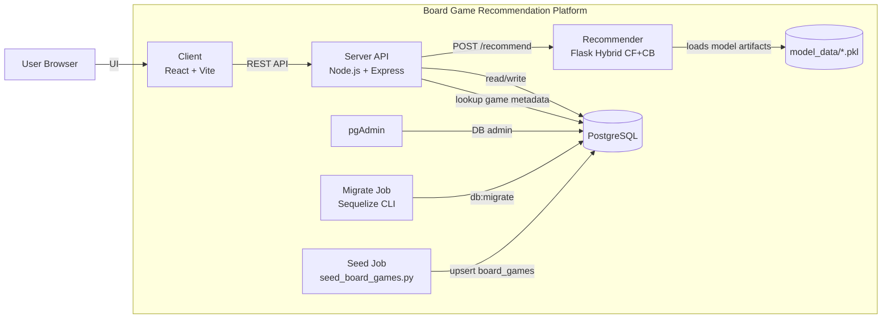
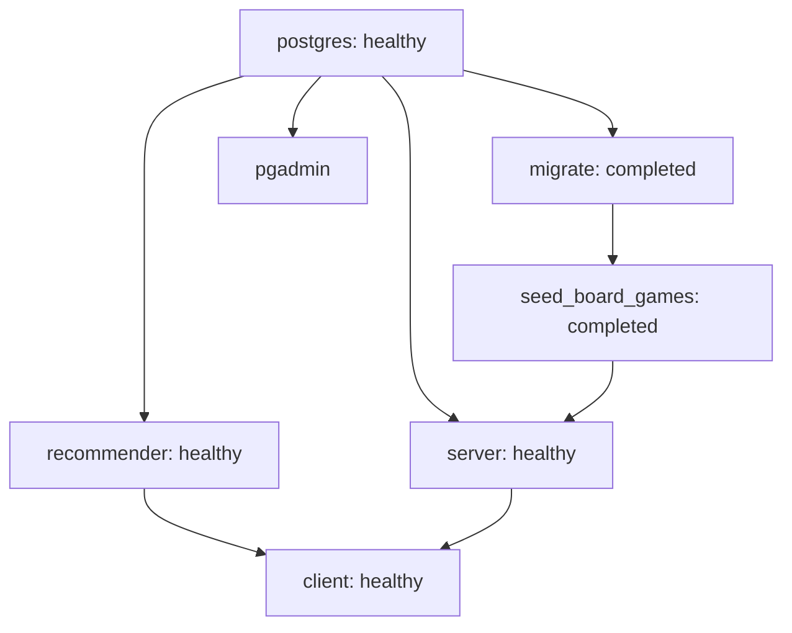
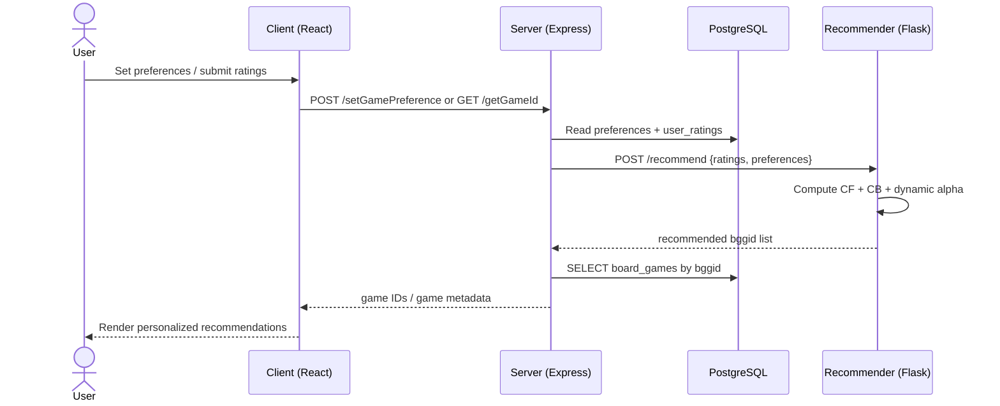
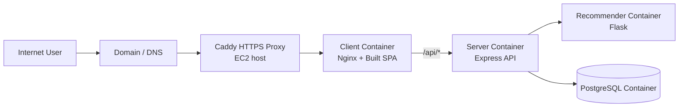

# Architecture (Diagrams as Code)

This document provides recruiter-friendly architecture views rendered by Mermaid on GitHub.

## 1) Container View (Local Compose)

## 2) Startup Dependency Graph (Compose)

## 3) Recommendation Request Flow

## 4) EC2 Production Topology

